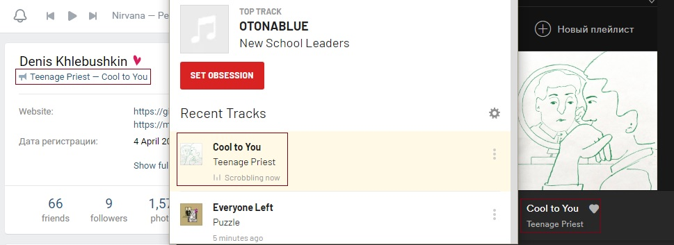

# Last2VK
Last.fm "Now Playing" broadcast to VK status message. Inspired by [P2LOVE](https://github.com/P2LOVE)'s [Spoti2VK](https://github.com/P2LOVE/Spoti2VK). Ready for Heroku.

**IMPORTANT!** Currently, the project does not work correctly on non-Russian servers. More than half of the songs will not be broadcast in the status, and proxies will not help. I'm trying my best to solve this problem.

## About
Initially, I wanted to broadcast my "Now Playing" status from Spotify to VK, but I found out that the Spotify API is absolutely not suitable for such purposes and requires Oauth. Then I decided to use Last.fm, it has a convenient API and only requires an API key.

## Setting up
Configure some global variables.

### VK_TOKEN
You need to get a token with access to audio methods. Go to [vkhost.github.io](https://vkhost.github.io), select "VK Admin" and copy the part of the address bar from `access_token=` to `&expires_in`. Here is your token.

### LASTFM_KEY
Get an API account here: [last.fm/api/account/create](https://www.last.fm/api/account/create) and copy your API Key.

### LASTFM_USERNAME
Your Last.fm username.

### REFRESH_DELAY
Time between checking Last.fm status (in secs). Default: "20".

### DEBUG
**"true" or "false"**

If debugging is enabled, an exception will cause the application to stop. Default: "false".

### RETRY_WITHOUT_ARTIST
**"true" or "false"**

Whether to retry the search if the full name is not found, using only the track name. Default: "true".

### USE_PROXIES
**"true" or "false"**

Whether to use Russian proxies. The search will not work properly if the machine has a non-Russian IP address (including Heroku), proxies can help **(but they really don't)**. Default: "true".

## Dependencies
- [requests](https://github.com/psf/requests)
- [free-proxy](https://github.com/jundymek/free-proxy) (optional)
